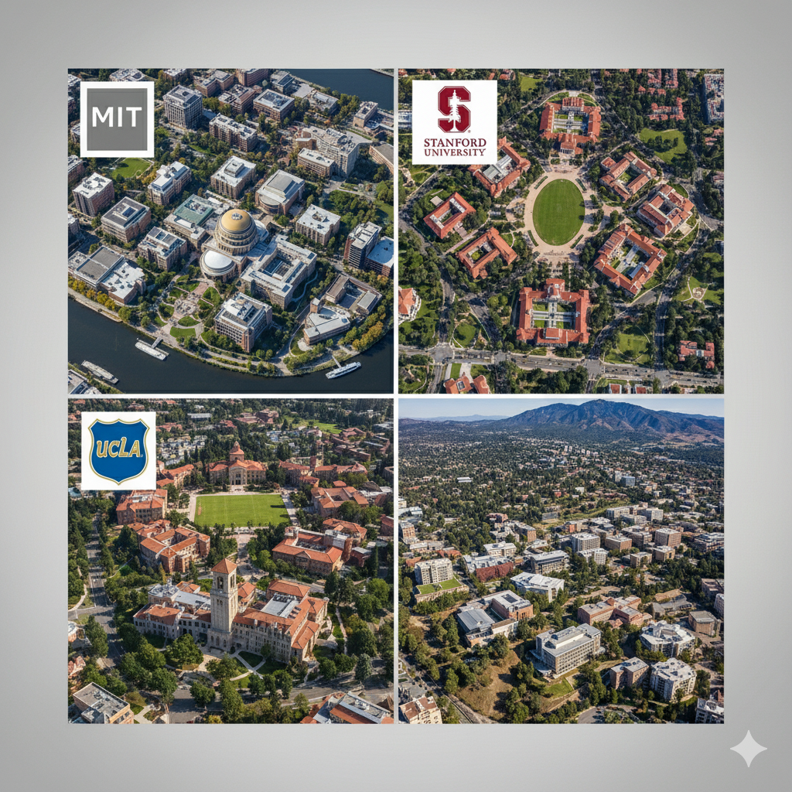
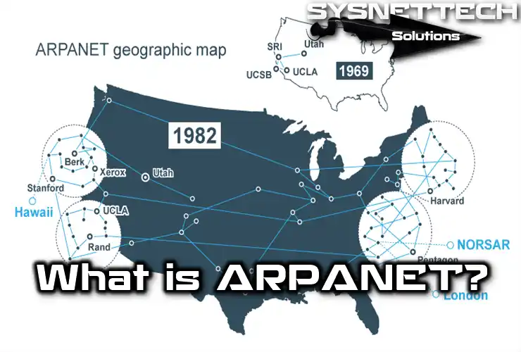
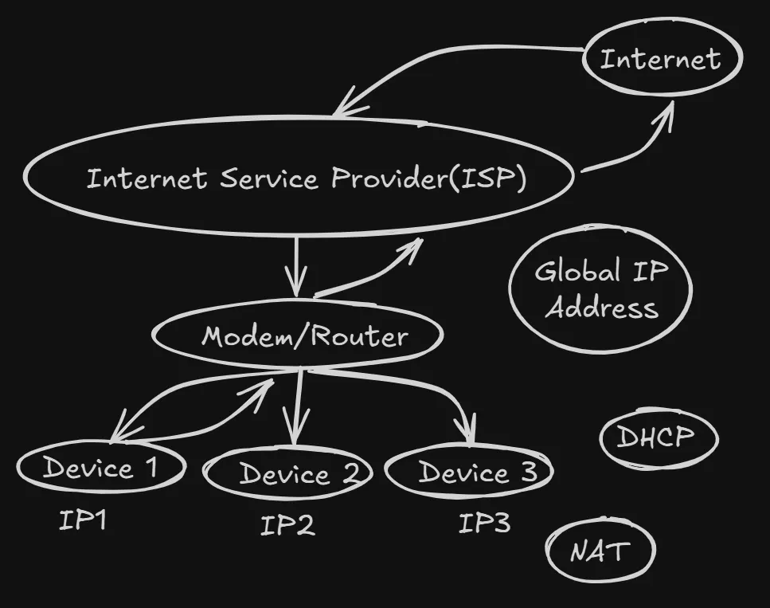
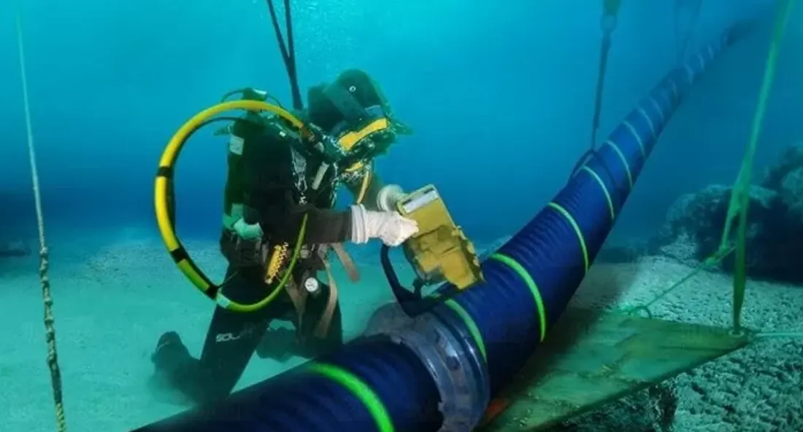

# Decoding the Digital World (S1-E01): The Unbreakable Agreements

## An Unconventional Introduction To The Internet
Ever wondered how a single click on "Order Now" triggers a global chain reaction, sending your request from your laptop, across oceans, to a server on another continent, and back with a confirmation in less time than it takes to blink once or twice? Or how you can have a seamless video call with someone halfway around the world?

Your first answer might be "Wi-Fi," "the cloud," or "data," right? But deep down,under the hood, the real engine is something much more fundamental: A set of unbreakable agreements.

Yep, even in the age of instant streaming and AI n all , the internet runs on a series of clever rules and addresses that were designed decades ago to solve a very serious problem. Now, I know what you might be thinking: "So you're saying That,my Netflix binge is possible because of some old agreements?"

Well, indirectly... yeah! To get the secret sauce,This time we don't need to go back 10,000 years, but we do need to hop in our time machine and travel back to the height of the Cold War. As some wise person once said, "need is the mother of invention," and in the 1950s, the need was survival.

## From Sputnik to Streaming: The Network Born out of COLD WAR.

Imagine the tense climate of the 1950s, the Cold War raging between the United States and the Soviet Union. The Soviets surprised the world by launching Sputnik, the first artificial satellite =>**SPUTNIK**, in 1957. This spurred the US government to action, creating the **Advanced Research Projects Agency (ARPA)** out of fear. ARPA's mission was clear: maintain the country's scientific and technological leadership.

One pressing challenge for ARPA was communication. Their facilities or research work were spread across the United States, and they needed a way for their computers to communicate reliably on the topic of reserach , even if parts of the network were compromised!, This need gave birth to **ARPANET**, connecting *Four key locations:* **MIT, Stanford, UCLA, and the University of Utah**. This was the very first glimpse of what would become the internet – a collection of computers connected together.

---

---

But connecting these four computers was just the first step. For them to actually understand each other;to share data without it becoming a garbled mess;they needed a common language. This fundamental need for a 'common language' gave rise to the most crucial element of the internet: Protocols.

## The Rules for the ROUTE: Why Protocols are Essential

A**Protocol** is simply a set of rules for communication. Think of it like posting a letter versus making a phone call. The letter (like an email) must arrive with every word intact and secure. The phone call (like a video stream) can handle a little static or a dropped word here and there without the conversation being lost. Different internet actions have different needs, and thus protocols manage these requirements.

These crucial rules so called 'Protocols' are managed and created by organizations like the **Internet Society**, where new ideas are proposed through *"Request for Comments" (RFCs)*. Two of the earliest and most fundamental protocols,which are globally accepted :

-  **TCP (Transmission Control Protocol):** This is the precise protocol for the letter, ensuring 100% of your data is delivered correctly.

- **UDP (User Datagram Protocol):** This is the fast, efficient protocol for the phone call, prioritizing speed over perfect delivery.

### From Research Papers to the World Wide Web: Documents that Link
As ARPANET grew, researchers wanted a better way to share documents that referenced other documents. They envisioned a system where clicking a piece of text *(a link)* would automatically take them to related information. This vision led to the groundbreaking work of**Tim Berners-Lee**, who in 1990 developed the **World Wide Web (WWW)** ; *Thanks to him ! You can read my blog :)*

The World Wide Web isn't the internet itself, but rather a system for accessing information resources Which stores numerous links of webpages, identified by **URLs (Uniform Resource Locators)** and interconnected by hyperlinks. The very first website, [info.cern.ch](info.cern.ch), was a demonstration of this revolutionary idea.

This World Wide Web was a brilliant system, but how did it actually work? When you clicked a hyperlink, what was happening behind the scenes? This interaction is powered by a simple yet powerful concept: the client-server architecture.

## The Client and the Server: Your Digital Interaction
Under the hood surface of most internet interactions is the **client-server model**. When you type *"google.com"* your computer acts as the **client**, sending a request to Google's server *a powerful computer designed to "serve" information*. The server then processes your request and sends back a response, which is the Google webpage. Interestingly, your own computer can act as both a client and a server, a common practice for developers testing websites on what they call a **"Local Host"**.

#### The Language of the Web: HTTP and HTTPS
So the client makes a request, and the server sends a response. But what language are they speaking? For the World Wide Web, that language is **HTTP (Hypertext Transfer Protocol)**. Protocol is just a fancy jargon for "Rules" okay ! if you haven't yet know about it ; Think of it as the official postal service rules for sending and receiving web pages,INSTEAD of letters *(Not the only,which u are thinking :) !!)*.

You've probably also seen HTTPS. The **'S'** stands for **Secure**. If HTTP is like sending a postcard that anyone can read, HTTPS is like sending a letter in a sealed, seiezed-proof envelope. It encrypts the data between your client and the server, which is why you should always look for the little lock icon 🔒 when you're entering passwords or credit card details online, Atleast to me they are always visible!.

But eventually As the number of web pages exploded, a new problem arose: how do you find information without knowing its exact URL? This led to the development of search engines, with **Yahoo** being one of the pioneers, helping users (clients) find information on countless servers across the web.

Every piece of data transmitted over the internet, whether it's an email or a video, doesn't travel as a single, giant block. Instead, it's broken down into **smaller chunks called packets.** To get these packets to the right place, the internet needs a sophisticated addressing system.

### Finding Your Way: An Internet Address Book
Imagine trying to send a parcel to a friend living in a large apartment building. You need three key pieces of information: the building's street address, their specific apartment number, and their name on the letter. The internet works in a very similar way.

#### Let's first say "Nice to meet you DNS !" :
- **DNS stands for Domain Name System,** and its job is simple: to turn human-friendly domain names (*like google.com*) into computer-friendly IP addresses (like *172.217.160.142*).Well tbh you will be amazed to know,**there are only 13 true DNS servers present across the globe** ; as DNS itself have a long history and technicalities behind !

**Now Think about it**: you don't remember your best friend's living address, you can visualize it but still don't know the exact location.  DNS is the Address list for the entire internet. Your browser asks DNS, *"Hey, what's the address for Google(yourfriend )?"* and a DNS server somewhere replies with the correct IP address. This entire lookup happens in a flash, before the webpage even starts to load.

Now that your browser has the correct address, it can package up your request and send it off. Imagine trying to send a parcel to a friend living in a large apartment building...

- **1.** **IP Addresses (The Building Address):** An IP (Internet Protocol) address is like the main street address for a device on the internet. It's a unique series of numbers (ex: *172.217.160.142*) that tells the global network which "building" to send the data packets to. When you type *google.com*, it's first translated into an IP address.

- **2.** **MAC Addresses (The Apartment Number):** Once the data packet arrives at your local network (ex: your home Wi-Fi), how does it know whether to go to your laptop or your phone? This is where the *MAC (Media Access Control)* address comes in. It's a permanent, physical address stucked into your device's network hardware (*like its Wi-Fi card*). Your router uses the MAC address to make the final, local delivery to the correct "apartment."

- **3. Port Numbers (The Recipient's Name):** The packet has arrived at your laptop—the correct building and apartment. But which application requested it? Was it your Chrome browser, your WhatsApp desktop app, or a game? The port number acts like the name on the mail, ensuring the data is handed to the specific application that's waiting for it.

##### Note : We wil look into it in detailed in upcoming ....... 

## The Hidden Highways:  Cables, Waves, and Network Sizes
How does data truly travel across these vast distances? It's a complex physical infrastructure. We can think of these networks in terms of their scale:

- **LAN (Local Area Network):** This is your personal network at home or in the office. Your Wi-Fi that connects your phone, laptop, and TV is a LAN. It's "Local."

- **WAN (Wide Area Network):** This is a massive network that connects cities, countries, and continents. The internet itself is the ultimate WAN. It's the global web of connections.

(You might also hear of a **MAN ==> Metropolitan Area Network**, which covers a city, sitting between a **LAN** and a **WAN**.)

---

---

These networks are built from physical connections. For intercontinental communication (the WAN), massive submarine **optical fiber cable**s are laid across ocean floors.  Within countries and cities (MANs and LANs), data travels through *optical fiber, coaxial cables*, and increasingly through wireless methods like Wi-Fi, 4G, and 5G. This entire hierarchy is managed by **Internet Service Providers (ISPs)** that connect our homes to the global network.

---

---

---

### The Internet's Blueprint: The OSI Model
To manage this incredible complexity, the OSI (Open Systems Interconnection) model was developed. It's a conceptual framework that divides the process of communication into seven distinct layers. Think of it like a meticulous courier service, where a package (your data) goes through various departments (layers), each adding or processing information before it reaches its destination.

## Setting the Stage for NEXT Ep :
So, our journey has taken us from a Cold War project to a global web of linked documents, all powered by a system of rules, languages, and addresses.

We've thrown around a lot of concepts: protocols like **TCP/UDP, the client-server model, the internet's address book (DNS, IP, MAC, Ports)**, and even the massive underwater cables that connect us all. But we've only scratched the surface.

Think of this first article as drawing the map for our treasure hunt. We've marked all the important locations, but we haven't started digging yet. In the upcoming articles, I will dive deep into each of these topics. We'll properly unpack the **seven layers of the OSI model**, explore exactly **how DNS finds the right number ?** so quickly, **look at the role of firewalls** in keeping us safe, and much more.

For now, Think of it as just setting the stage. You now have the foundational knowledge of so called **unbreakable agreements** to understand the bigger picture of how our digital world is built. *Stay tuned for next epsiode but do come here not the Netfilx*  **:>)** !! 

A**yush,19  =>Still figuring things out !**