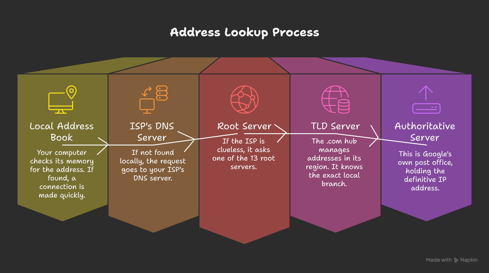
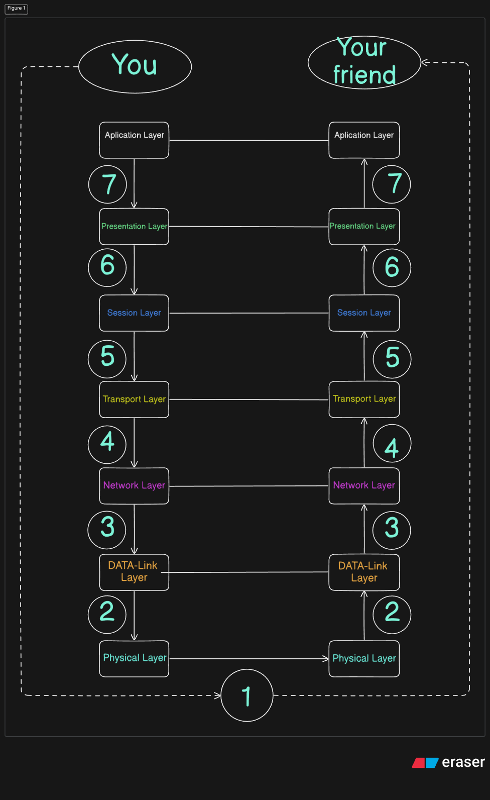

#  Episode 2: Beneath the Surface—The Hidden Blueprint of the Internet

 ---

Last time, we mapped out the skeleton of the internet => IP addresses, routers, even those insane submarine cables lying  beneath oceans. But that was just the surface.Inhere we’re cracking open the protocol vault (surface).

So here’s the scene to thinkof : You type “Hello” on WhatsApp. Just five letters. But in less than a second, that message gets shattered into invisible fragments, races across continents, dodges traffic of other msgs, gets stitched back together, and lands perfectly on your friend’s phone. No lag. No distortion. Just clean delivery.

Feels like magic, right? But it’s not.
The real architect under  this digital teleportation is something most people never talk about: The OSI Model = Seven layers. Each layer quietly making sure your memes, midnight rants, and voice notes reach their destination without falling apart !! .

So yeah, drink water & sit tight coz ,this gonna be the longest dive beneath the surface . We’re not just digging into networking—we’re decoding the blueprint that powers everything from Netflix to NASA. And trust me, once you see how it works, you’ll never look at a simple “Hello” the same way again & will also *thank this OSI cozof , which u all can read my blog !!*

---
## From Digital Chaos to Clarity—Birth of Concept OSI.

Let’s rewind for a second:

The internet isn’t one giant machine=it’s a wild patchwork of millions of networks stitched together across the globe. Different devices. Different developers. Different languages.right ? Now imagine two developers ;one in Germany, one in India ,building apps that need to talk to each other. If they each made up their own rules for how data should travel, it’d be like trying to play football with two different rulebooks. Total chaos ,agreed?.
That’s where protocols come in. They’re not just rules—they’re agreements. The digital Standard that says, “Hey, I’ll speak your language if you speak mine.”

and then there comes.......O...S...I .

The **OSI (Open Systems Interconnection) model** is that *standard*. Think of it as the official instruction manual for the internet, made so that different computer systems can actually communicate. It breaks down the whole process into seven distinct, manageable layers. Each layer has a specific job, and they all work together.

---
## Meticulous Courier Service of the Internet: A Package's Full Journey Through the OSI Model
Alright, let's connect all the dots. We're going to follow a single message=your "*Hello*" sent on WhatsApp—on its complete journey from your phone to a friend's across the world. We'll watch as the "*Hello*" gets wrapped up layer by layer on your end (a process called **encapsulation**), and then see how it gets unwrapped in the reverse order on your friend's end to reveal the original message (a process called **decapsulation**).

Let's ship that "*Hello*" and see it delivered.

---

### The First Half: Packing the Box (Encapsulation) - Preparing "Hello" for its Journey
This is the journey down the seven layers on your phone. Each layer adds its own wrapper and label to your "Hello" message.

#### LAYER 7: THE APPLICATION LAYER => FILLING OUT THE SHIPPING FORM

You type **"Hello"** into WhatsApp and hit send. *This is Layer 7 in action*. You, the user, are interacting with the application to create the data that needs to be sent. This layer is the courier service counter where you drop off your item ("Hello") and state its destination.

You're not the app itself, but you're using it to give instructions. The protocols here are the different types of forms you fill out based on what you're sending:

- **HTTP/HTTPS:** The standard form for sending or requesting a "webpage" package.

- **SMTP:** The special form you use specifically for sending an "email" package.

- **DNS:** The most critical first step. Before your "*Hello*" can be sent, the system needs your friend's exact address. You can't send a package to "*My Friend's Phone*"; you need a precise IP address. DNS is the service that finds it.

#### Deep Dive: Finding the Address for the Package (DNS Lookup)
When you send a message to a contact, a similar, though often more direct, lookup happens to find the server that handles the message traffic. For a web equivalent like typing **google.com**, it's a chain reaction:

1.**Local Address Book (Cache Check):** Your device first checks its memory. *"Have I talked to this server recently?*" If the IP address is saved, **BAM!** => a connection is made. Super fast.

2. **Local Post Office (ISP's Server):** If not, your request goes to your ISP's DNS server. (Yep,your ISP also knows the destination of every package you send!)

3. **Country Head Office (Root Server):** If your local post office is clueless, it asks one of the **13 mai**n head offices(**ROOT SERVER**) in the world. The Root Server is like a master directory; it doesn't know the full address but knows which regional office to ask next based on the domain *(.com, .org, .in)*.

4. **Regional Hub (TLD Server):** The *.com* hub manages all addresses in its region having .com & Similarly there are others aswell like *.org ,.io ,.in*. It points to the exact local branch **(Authoritative Server)** for *google.com*.

5. **The Local Branch (Authoritative Server):** Finally! This is Google's own post office (Server). It holds the definitive IP address and sends it all the way back down the chain to your computer.

**Connection Completed !** Now,Your device gets the IP address = official address for your friend's message server is known, the process of wrapping your *"Hello"* can truly begin.

---

#### LAYER 6: THE PRESENTATION LAYER => SPECIAL SERVICES & GIFT WRAPPING

Your *"Hello"* message is now passed down to the courier's special services department. This layer acts as a universal translator and security guard, making sure your message is in a standard format of **Binary(Machine Language)**, is secure, and is as small as possible before its journey.

What it does to your "Hello":

- **Translation:** It ensures your "Hello" is formatted in a universal character set (like Binary,UTF-8)any device in the world can understand.

- **Encryption:** This is critical. It scrambles your *"Hello"* into unreadable ciphertext (e.g., *aJk&bZ!p*). This is the tamper-proof, locked box that ensures no one can read your message in transit rather than your friend.

- **Compression:** For a tiny message like *"Hello"*, this step is negligible. But if you sent a long paragraph, this layer would shrink it down to save bandwidth, like vacuum-sealer.

**Connecting to the EP01 :** Remember in our first blog when we talked about the *'S'* in **HTTPS** and that little lock icon 🔒? This layer is where that security magic happens. It's this department handling the locks and keys (using protocols like SSL/TLS[*don't get overwhelm ,we'll see it.*]) to keep your "Hello" safe.

---

#### LAYER 5: THE SESSION LAYER => GETTING YOUR TRACKING NUMBER

Your encrypted *"Hello"* is ready. Now it moves to the order management desk. This layer's job is to open a dedicated communication line *Kinda wire in clouds* between you and your friend's device and manage it.

What it does:

- It **establishes** the connection, like starting a phone call before you speak. This ensures the other end is ready to receive data.

- It **manages** this "session" to keep the conversation going. For your WhatsApp message, it ensures the connection stays open long enough for the "Hello" to be sent and acknowledged.

- It **terminates** the session once the communication/order is done.

Think of this layer as assigning a unique tracking number(*kinda token given in college Canteen*) to your entire conversation, so the system knows which messages belong to which chat.

**Connecting to the EP01 (Pro Tip):** 

How Websites Remember Your Tracking Number! 
Ans => **(Cookies)**

As we've touched on, the web's main protocol, HTTP, tbh it is  "stateless",means it forgets you instantly as soon as u leave the page/site/app .but then you might question " So,how does a site like Amazon keep you logged in across different pages?"

well it's coz of **Cookies**.

This cookie is nothing but just a tiny text file. When you log in, the server gives your browser**a cookie with a unique ID (a tracking sticker)**.That's why  For every page you visit, your browser shows that sticker having two HTMl buttons **"Accept Cookies"** & **"Reject Cookies"**.Once , you click the first one ; The server sees it and says, *"Ah, I remember this session! The order is still active."* It’s how your shopping cart on Amazon stays full, even though the underlying protocol has no memory.

---

#### LAYER 4: THE TRANSPORT LAYER => THE MAIN PACKAGING HUB

.png)

Your *"Hello"* now enters the main logistics hub. This is where the core shipping strategy is get decided. This layer is kinda obsessed with reliability, ensuring your message gets from the sending application (*WhatsApp on your phone*) to the receiving application (*WhatsApp on your friend's phone*) perfectly.

What it does to your "*Hello*":

- **Segmentation:** Your "*Hello*" is small, so it fits neatly into one box, called a **segment**. If you sent a video, this layer would chop it into thousands of smaller, numbered segments.

- **Port Numbers:** It adds source and destination **port numbers**. This is like writing on the box: "*From: WhatsApp*" and "*To: WhatsApp.*" The IP address (added next) gets it to the right device; the port number gets it to the right app on that device.

- **Error Control:** It adds a checksum = a special code—to the segment. The receiving end will use this to check if the "*Hello*" message was corrupted during transit.

**Connecting to the EP01**:
 *Choosing Your Shipping Service (TCP vs. UDP)*
This is where you choose your service:

- **TCP (Transmission Control Protocol):** The premium, tracked courier. It establishes a connection first **(the three-way handshake)**[*we'll look it into it in upcoming....*], guarantees every segment of your message arrives in order, and re-sends any that get lost. Perfect for texts and emails where every word matters. Your "*Hello*" will almost certainly use TCP.

- **UDP (User Datagram Protocol):** The fast, no-frills(no extra) option. "*It just sends the data and hopes for the best !!*". Great for video calls or gaming, where a single lost frame is better than lagging to wait for a re-send.

---

#### LAYER 3: THE NETWORK LAYER => THE GLOBAL ROUTING COORDINATOR

Now,the segment containing your "Hello" gets its main global shipping label. This layer's job is to get the data from your device to your friend's device, no matter where it is in the world. Routers are the superstars here(*not the disco wala !!*).

What it does:

- **Logical Addressing:** It wraps the segment inside a **packet** and adds the *sender's (your)* and the *receiver's (your friend's*) IP Addresses. Your "Hello" now has the full global address of the destination building.

- **Routing:** This is the magic. Routers across the internet look at the destination IP address on the packet and act like a global GPS, calculating the best path for your "Hello" to travel from network to network.

**Connecting to the EP01 : The Global Address (IP) vs. The Local Address (MAC)**
if u are able to recall ; **IP address** is the global "building address." It gets your "Hello" to the correct home network. In the next layer, we'll add the "apartment number" (**the MAC address**) for final, specific delivery.

---

#### LAYER 2: THE DATA LINK LAYER => THE LOCAL DELIVERY DRIVER

The packet with your "Hello" is ready for its global journey now, but first, it needs to get from your phone to your local Wi-Fi router. This layer handles that very first local hop.

What it does:

- **Physical Addressing:** It takes the IP packet and puts it inside its final wrapper, a container called a **frame**. It then adds the **MAC Addresses=the hardware IDs** for the first hop (e.g., from your phone's Wi-Fi card to your router).

- **Error Detection:** It does one final check on the frame to ensure it wasn't damaged before being sent out onto the main *track/road/truck*.

**Connecting to the Past: The Final Piece of the Address**
hope, U already recalled , **MAC address** is the "apartment number." The IP address (Layer 3) gets the package to the right building (your home Wi-Fi network), but the MAC address ensures it's delivered from the correct apartment *(your phone)* to the front door *(your router)*.

---

#### LAYER 1: THE PHYSICAL LAYER => THE TRUCKS, PLANES, AND ROADS

finally,We've hit rock bottom! The fully wrapped "Hello" message, now a frame of digital 1s and 0s, is handed to the delivery infrastructure. This layer converts those bits into actual physical signals.

What it does:

- It turns the 1s and 0s of your "Hello" frame into radio waves (for Wi-Fi), **flashes of light** (for fiber-optic cables), or **electrical signals** (for Ethernet cables).

**Connecting to the EP01: The Real-World Internet**
This is where the massive submarine fiber-optic cables we saw on the map in our first blog live. These are the actual roads, ships, and planes that carry the physical signals representing your "Hello" across the globe.

---
### The Second Half: Unpacking the Box (Decapsulation)

Now that the physical signals(radio waves) carrying your "Hello" have arrived at your friend's device! ,the process happens in perfect reverse order. Each layer unwraps the package, reads its label, and passes the contents from **bottom => Up**.

- **LAYER 1 -> 2: THE ARRIVAL & LOCAL DELIVERY**
Now these radio waves are received by your friend's phone (**Layer 1**) and converted back into a frame of 1s and 0s. The network card (**Layer 2**) checks the MAC address. "Is this for me?" Yes. It unwraps the frame and passes the packet inside up.

- **LAYER 2 -> 3: ENTERING THE MAILROOM**
The network layer (**Layer 3**) on your friend's phone looks at the IP address on the packet. *"Yep, this is for our device."* It confirms delivery and unwraps the packet, passing the segment up.

- **LAYER 3 -> 4: SORTING THE CONTENTS**
The transport layer (**Layer 4**) receives the segment. It checks the port number to see it's destined for WhatsApp. It also runs a checksum to ensure the "Hello" wasn't corrupted. Since it's all good, it passes the clean data upward.

- **LAYER 4 -> 5: CLOSING THE ORDER**
The session layer (**Layer 5**) sees that the message has been delivered successfully and, after the conversation is over, it will terminate the connection.

- **LAYER 5 -> 6: UNLOCKING AND TRANSLATING**
The presentation layer (**Layer 6**) receives the encrypted data (*aJk&bZ!p*). It uses the right key to **decrypt** it, turning it back into the universally formatted "*Hello.*"

- **LAYER 6 -> 7: THE MESSAGE IS DELIVERED!**
Finally, the original, perfect "*Hello*" data is handed to the application layer (**Layer 7**). WhatsApp receives the data, and the message "Hello" pops up on your friend's screen.

**NOTE** : So Even if the data is crossing these seven layers twice on two ends in sequence  ;still it feels like each layer is communicating to corresponding layer on other end !! 

And that's the full, round-trip journey! By wrapping and unwrapping the data in this precise order, the OSI model makes sure your simple "Hello" can cross the globe in an instant, perfectly preserved. It's the hidden blueprint that makes our digital world possible.